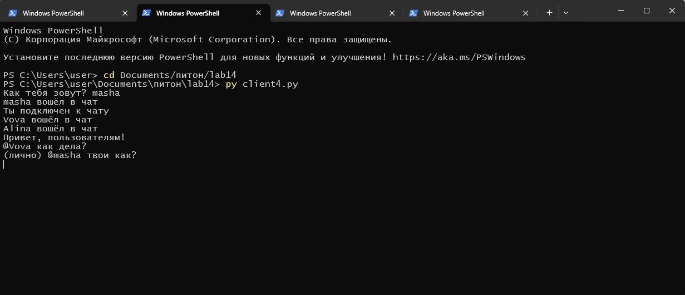
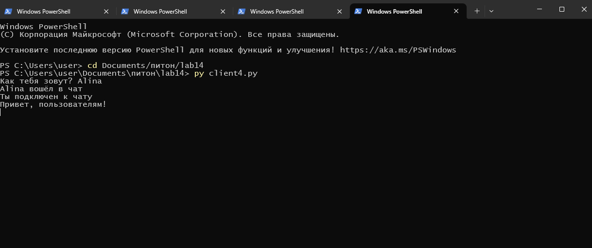

## Задание 4
Реализовать двухпользовательский или многопользовательский чат. Для максимального количества баллов реализуйте многопользовательский чат.

Требования:

Обязательно использовать библиотеку socket.
Для многопользовательского чата необходимо использовать библиотеку threading.
## Код сервера
```python
import socket
import threading

users = []     # список подключений
names = []     # имена пользователей

def send_all(msg, sender=None):
    for u in users:
        if u != sender:
            try:
                u.send(msg)
            except:
                users.remove(u)

def send_one(msg, target_name):
    if target_name in names:
        i = names.index(target_name)
        users[i].send(msg)

def handle_person(user_sock):
    while True:
        try:
            msg = user_sock.recv(1024)
            text = msg.decode("utf-8")

            if text.startswith("@"):
                parts = text.split(" ", 1)
                if len(parts) == 2:
                    target = parts[0][1:]  # убираем @
                    private_msg = f"(лично) {text}".encode("utf-8")
                    send_one(private_msg, target)
            else:
                send_all(msg, user_sock)

        except:
            if user_sock in users:
                i = users.index(user_sock)
                name = names[i]

                users.remove(user_sock)
                names.remove(name)
                user_sock.close()

                send_all(f"{name} вышел из чата".encode("utf-8"))
                break

def accept_connections():
    server = socket.socket(socket.AF_INET, socket.SOCK_STREAM)
    server.bind(("0.0.0.0", 5555))
    server.listen()
    print("Сервер запущен!")

    while True:
        user_sock, addr = server.accept()
        print(f"Подключился {addr}")

        user_sock.send("NAME".encode("utf-8"))
        user_name = user_sock.recv(1024).decode("utf-8")

        users.append(user_sock)
        names.append(user_name)

        print(f"Имя: {user_name}")
        send_all(f"{user_name} вошёл в чат".encode("utf-8"))
        user_sock.send("Ты подключен к чату".encode("utf-8"))

        t = threading.Thread(target=handle_person, args=(user_sock,))
        t.start()

if __name__ == "__main__":
    accept_connections()
```
## Код клиента
```python
import socket
import threading

name = input("Как тебя зовут? ")

sock = socket.socket(socket.AF_INET, socket.SOCK_STREAM)
sock.connect(("127.0.0.1", 5555))

# поток для получения сообщений
def get_messages():
    while True:
        try:
            msg = sock.recv(1024).decode("utf-8")
            if msg == "NAME":
                sock.send(name.encode("utf-8"))
            else:
                print(msg)
        except:
            print("Соединение потеряно")
            sock.close()
            break

# поток для отправки сообщений
def send_messages():
    while True:
        text = input()
        if text:  # если что-то написано
            sock.send(f"{text}".encode("utf-8"))

# запуск потоков
threading.Thread(target=get_messages).start()
threading.Thread(target=send_messages).start()
```
## Сервер

## Клиент 1

## Клиент 2

## Клиент 3

