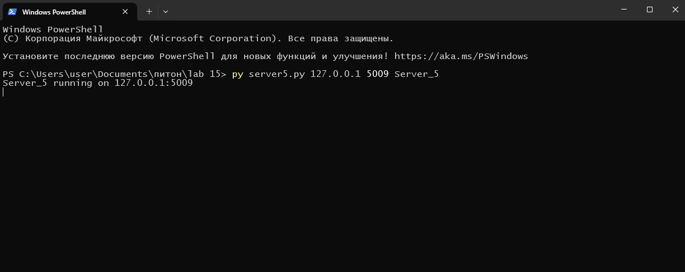
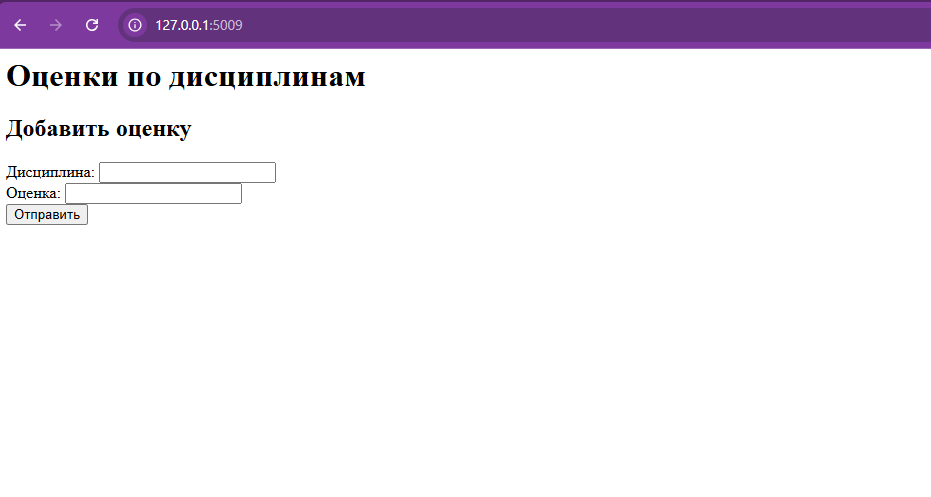

## Задание 5
Написать простой веб-сервер для обработки GET и POST HTTP-запросов с помощью библиотеки socket в Python.

Задание:

Сервер должен:
Принять и записать информацию о дисциплине и оценке по дисциплине.
Отдать информацию обо всех оценках по дисциплинам в виде HTML-страницы.
## Код сервера
```python
import socket
import sys

class MyHTTPServer:
    def __init__(self, host='127.0.0.1', port=8080, server_name="MyServer"):
        self._host = host
        self._port = port
        self._server_name = server_name
        self._grades = {} 

    def serve_forever(self):
        serv_sock = socket.socket(socket.AF_INET, socket.SOCK_STREAM)
        serv_sock.setsockopt(socket.SOL_SOCKET, socket.SO_REUSEADDR, 1)

        try:
            serv_sock.bind((self._host, self._port))
            serv_sock.listen()
            print(f"{self._server_name} running on {self._host}:{self._port}")

            while True:
                conn, _ = serv_sock.accept()
                self.serve_client(conn)
        finally:
            serv_sock.close()

    def serve_client(self, conn):
        try:
            req = self.parse_request(conn)
            resp = self.handle_request(req)
            self.send_response(conn, resp)
        except Exception as e:
            self.send_error(conn, e)
        finally:
            conn.close()

    def parse_request(self, conn):
        rfile = conn.makefile('r', encoding='utf-8')
        request_line = rfile.readline().strip().split()

        if len(request_line) != 3:
            raise ValueError("Некорректный HTTP-запрос")

        method, url, version = request_line

        headers = {}
        while True:
            line = rfile.readline().strip()
            if not line:
                break
            key, value = line.split(":", 1)
            headers[key.strip()] = value.strip()

        body = ''
        if method.upper() == 'POST':
            length = int(headers.get('Content-Length', 0))
            body = rfile.read(length)

        return {
            'method': method.upper(),
            'url': url,
            'body': body
        }

    def handle_request(self, req):
        method = req['method']
        body = req['body']

        if method == 'GET':
            html = "<h1>Оценки по дисциплинам</h1><ul>"

            for discipline, marks in self._grades.items():
                avg = sum(marks) / len(marks)
                html += f"<li>{discipline}: {marks} (среднее: {avg:.2f})</li>"

            html += "</ul>"
            html += """
            <h2>Добавить оценку</h2>
            <form method="POST">
                Дисциплина: <input name="discipline"><br>
                Оценка: <input name="mark"><br>
                <input type="submit">
            </form>
            """

            return {'status': 200, 'reason': 'OK', 'body': html}

        elif method == 'POST':
            post_params = dict(
                pair.split('=') for pair in body.split('&') if '=' in pair
            )

            discipline = post_params.get('discipline', 'Не указано')
            mark = post_params.get('mark', '')

            try:
                mark = int(mark)
            except:
                return {
                    'status': 400,
                    'reason': 'Bad Request',
                    'body': '<h1>Оценка должна быть числом</h1>'
                }

            if discipline not in self._grades:
                self._grades[discipline] = []

            self._grades[discipline].append(mark)

            return {
                'status': 200,
                'reason': 'OK',
                'body': "<h1>Оценка добавлена</h1><a href='/'>Назад</a>"
            }

        else:
            return {
                'status': 405,
                'reason': 'Method Not Allowed',
                'body': '<h1>Метод не поддерживается</h1>'
            }

    def send_response(self, conn, resp):
        body = resp['body']
        status_line = f"HTTP/1.1 {resp['status']} {resp['reason']}\r\n"
        headers = (
            "Content-Type: text/html; charset=utf-8\r\n"
            f"Content-Length: {len(body.encode('utf-8'))}\r\n\r\n"
        )

        conn.sendall(status_line.encode('utf-8'))
        conn.sendall(headers.encode('utf-8'))
        conn.sendall(body.encode('utf-8'))

    def send_error(self, conn, err):
        body = f"<h1>500 Internal Server Error</h1><p>{err}</p>"
        response = (
            "HTTP/1.1 500 Internal Server Error\r\n"
            f"Content-Length: {len(body.encode('utf-8'))}\r\n\r\n"
            + body
        )
        conn.sendall(response.encode('utf-8'))


if __name__ == '__main__':
    host = sys.argv[1] if len(sys.argv) > 1 else '127.0.0.1'
    port = int(sys.argv[2]) if len(sys.argv) > 2 else 8080
    name = sys.argv[3] if len(sys.argv) > 3 else "MyServer"

    serv = MyHTTPServer(host, port, name)
    try:
        serv.serve_forever()
    except KeyboardInterrupt:
        print("\nServer stopped")

```
## Сервер

## Html-страница стартовая

## Html-страница ввод данных

## Html-страница данные сохранены

## Html-страница отображение данных
