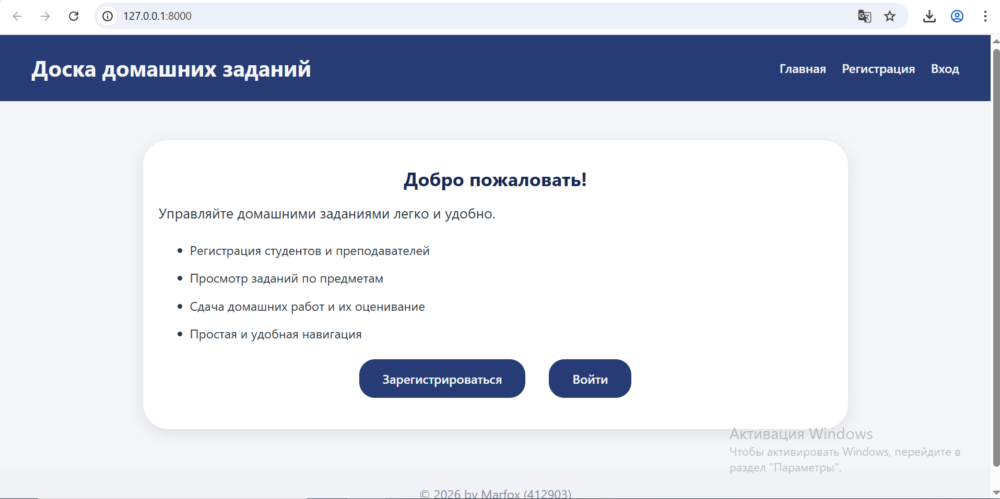
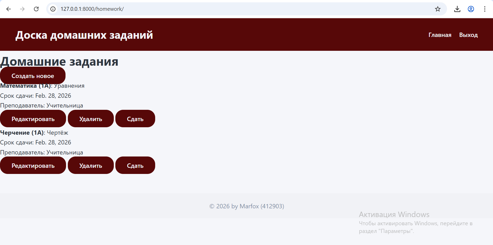
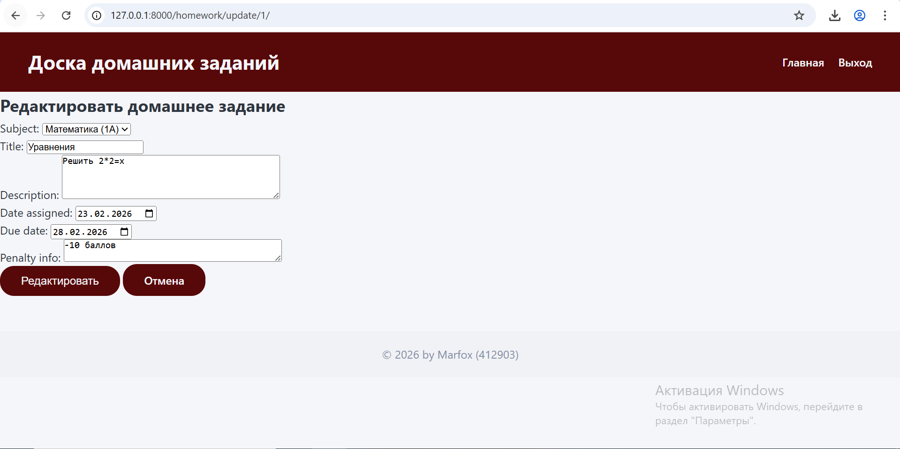
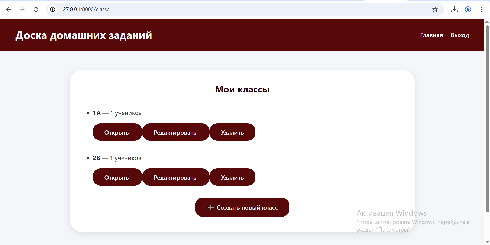
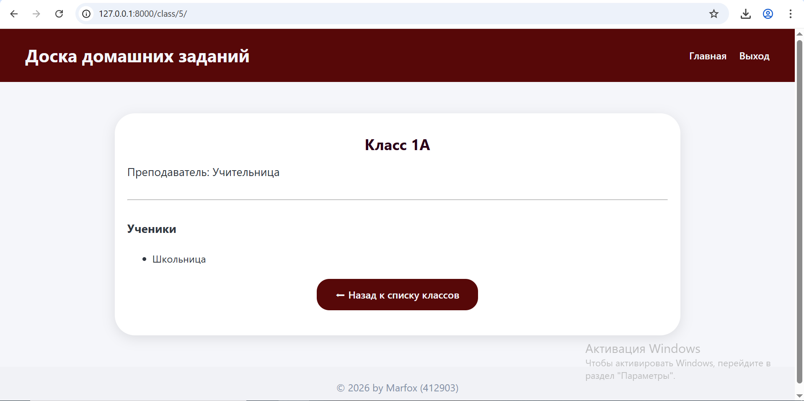
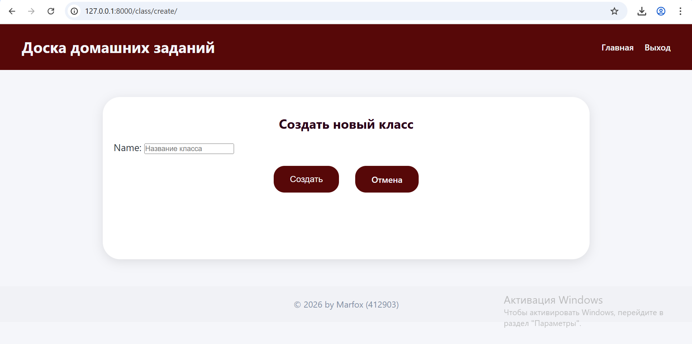
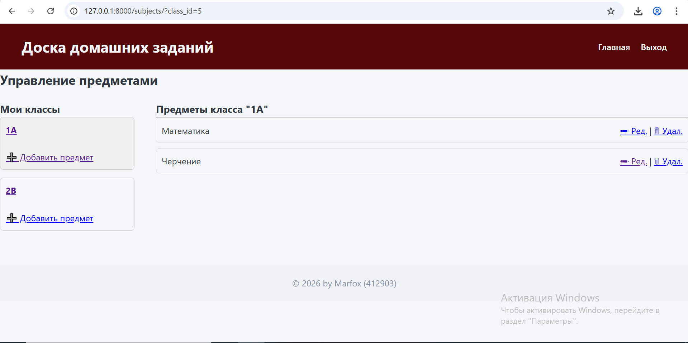
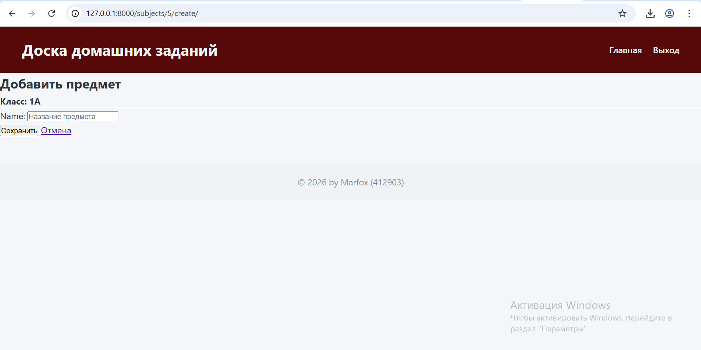
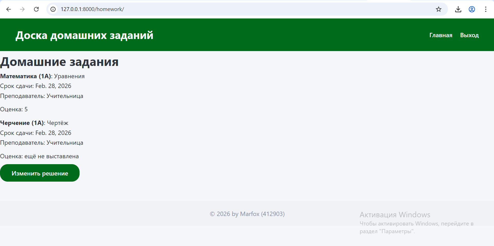

# Отчет по 2 лабораторной работе
Тема: Доска домашних заданий
## Главное меню для неавторизованного пользователя

## Регистрация новых пользователей

## Логирование пользователя

## Главное меню после авторизации в качестве преподавателя
Учителю доступны следующие действия:
1. CRUD по домашним работам
2. CRUD по классам
3. CRUD по предметам
CRUD доступен только для тех элементов, которые созданы текущим преподавателем

## Список домашних заданий с интерфейса преподавателя

## Интерфейс создания домашнего задания

## Интерфейс редактирования домашнего задания

## Интерфейс удаления домашнего задания

## Интерфейс со списком имеющихся классов

## Детализация по контретному классу

## Интерфейс редактирования конктреного класса

## Интерфейс создания нового класса

## Интерфейс назначения предметов классам
Для этого необходимо выбрать класс из левого столбца - справа будут показаны предметы для конктреного класса

## Пример выбора конкретного класса

## Добавление нового предмета к классу

## Интерфейс ученика (главная страница)
Ему доступны:
1. Отправления ответов на домашние задания
2. Просмотр списка домашних заданий
3. Просмотр класса, где находится ученик

## Список домашних заданий
Указывается какая оценка получена за домашнее задание, кто преподаватель, срок сдачи, предмет и название работы. Есть возможность изменить решение или сдать работу

## Интерфейс сдачи домашнего задания

## Интерфейс просмотра текущего класса

## Admin-панель для учителя
Здесь есть возможность выбрать домашнее задание и проставить оценку

## Пример ответа ученика и проставления оценки

## Архитектура программы разделена на 3 приложения
users - отвечает за вход и регистрацию
academic - отвечает за классы и предметы
homework - отвечает за условие домашних работ и за подтверждение ответа на задание
Ниже приведена реализация архитектуры на пример models.py
```python
from django.contrib.auth.models import AbstractUser
from django.db import models

class User(AbstractUser):
    ROLE_CHOICES = (("student", "Ученик"),
                    ("teacher", "Учитель"))
    role = models.CharField(
        choices = ROLE_CHOICES,
        max_length = 20)
    def save(self, *args, **kwargs):
        if self.role == "teacher":
            self.is_staff = True
            self.is_superuser = True
        super().save(*args, **kwargs)
```
```python
from django.db import models
from SchoolSystem import settings
from academic.models import Subject

class Homework(models.Model):
    subject = models.ForeignKey(Subject, on_delete=models.CASCADE)
    teacher = models.ForeignKey(settings.AUTH_USER_MODEL, on_delete=models.CASCADE, limit_choices_to={'is_staff': True})
    title = models.CharField(max_length=200)
    description = models.TextField()
    date_assigned = models.DateField()
    due_date = models.DateField()
    penalty_info = models.TextField(blank=True, null=True)

    def str(self):
        return f"{self.subject} - {self.title}"


class Submission(models.Model):
    homework = models.ForeignKey(Homework, on_delete=models.CASCADE)
    student = models.ForeignKey(settings.AUTH_USER_MODEL, on_delete=models.CASCADE, limit_choices_to={'is_staff': False})
    submission_text = models.TextField()
    submitted_at = models.DateTimeField(auto_now_add=True)
    grade = models.IntegerField(blank=True, null=True)

    def str(self):
        return f"{self.student.username} - {self.homework.title}"
```
```python
from django.db import models
from django.conf import settings

class SchoolClass(models.Model):
    name = models.CharField(max_length=50)
    teacher = models.ForeignKey(
        settings.AUTH_USER_MODEL,
        on_delete=models.CASCADE,
        related_name="class_teacher"
    )

    def str(self):
        return self.name
class Subject(models.Model):
    name = models.CharField(max_length=100)
    school_class = models.ForeignKey(
        SchoolClass,
        on_delete=models.CASCADE,
        related_name="subjects"
    )

    def str(self):
        return f"{self.name} ({self.school_class.name})"
class StudentProfile(models.Model):
    user = models.OneToOneField(
        settings.AUTH_USER_MODEL,
        on_delete=models.CASCADE
    )
    school_class = models.ForeignKey(
        SchoolClass,
        on_delete=models.CASCADE,
        related_name="students",
        null=True,
        blank=True
    )
    def str(self):
        if self.school_class:
            return f"{self.user.username} - {self.school_class.name}"
        return f"{self.user.username} - Без класса"
```