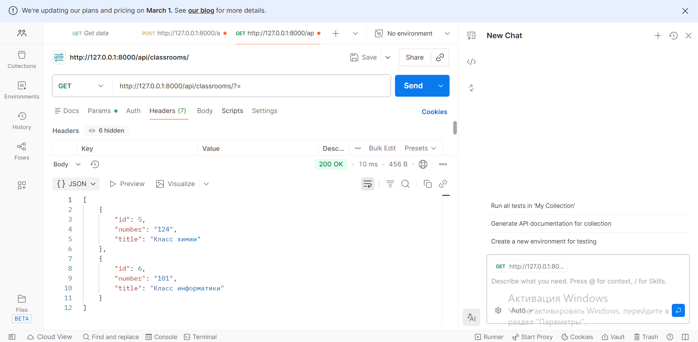
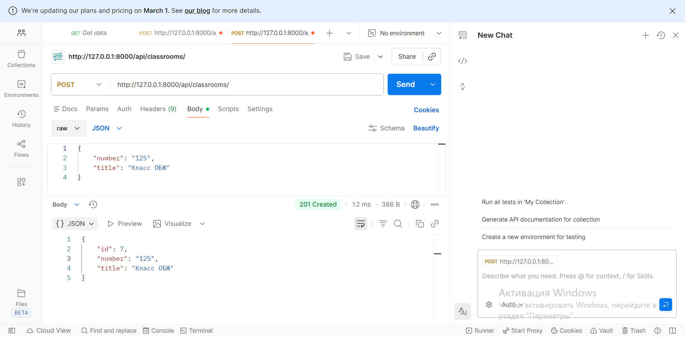

# Отчет по 3 лабораторной работе
Тема: Реализация интерфейса завуча для составления расписания и административных аспектов 
## Демонстрация регистрации нового пользователя при помощи djoser

## Получение токена при помощи djoser

## GET-запрос на получение списка кабинетов (пользователь не авторизован)

## GET-запрос на получение списка кабинетов (пользователь авторизован)

## Пример GET-запроса конктреного кабинета

## Пример POST-запроса на создание нового кабинета (у пользователя недостаточно прав)

## Пример успешного выполнения POST-запроса (пользователь - завуч)

## urls.py - демонстрация реализации роутера
```python
from django.contrib import admin
from django.urls import path, include
from rest_framework.routers import DefaultRouter
from drf_spectacular.views import SpectacularAPIView, SpectacularSwaggerView

from core.views import (
    PeriodViewSet, SubjectViewSet, ClassroomViewSet, TeacherViewSet,
    SchoolClassViewSet, TeachingAssignmentViewSet, ScheduleEntryViewSet,
    StudentViewSet, GradeViewSet, AnalyticsViewSet
)

router = DefaultRouter()
router.register(r"periods", PeriodViewSet)
router.register(r"subjects", SubjectViewSet)
router.register(r"classrooms", ClassroomViewSet)
router.register(r"teachers", TeacherViewSet)
router.register(r"classes", SchoolClassViewSet)
router.register(r"assignments", TeachingAssignmentViewSet)
router.register(r"schedule", ScheduleEntryViewSet)
router.register(r"students", StudentViewSet)
router.register(r"grades", GradeViewSet)
router.register(r"analytics", AnalyticsViewSet, basename="analytics")

urlpatterns = [
    path("admin/", admin.site.urls),

    path("api/", include(router.urls)),
    path("api-auth/", include("rest_framework.urls")),

    # Djoser endpoints
    path("api/auth/", include("djoser.urls")),
    path("api/auth/", include("djoser.urls.authtoken")),

    # OpenAPI/Swagger
    path("api/schema/", SpectacularAPIView.as_view(), name="schema"),
]
```
## Демонстрация сериализации базы данных
```python
from rest_framework import serializers
from .models import (
    Period, Subject, Classroom, Teacher, SchoolClass,
    TeachingAssignment, ScheduleEntry, Student, Grade
)

class PeriodSerializer(serializers.ModelSerializer):
    class Meta:
        model = Period
        fields = "__all__"

class SubjectSerializer(serializers.ModelSerializer):
    class Meta:
        model = Subject
        fields = "__all__"

class ClassroomSerializer(serializers.ModelSerializer):
    class Meta:
        model = Classroom
        fields = "__all__"

class TeacherSerializer(serializers.ModelSerializer):
    class Meta:
        model = Teacher
        fields = "__all__"

class SchoolClassSerializer(serializers.ModelSerializer):
    class Meta:
        model = SchoolClass
        fields = "__all__"

class TeachingAssignmentSerializer(serializers.ModelSerializer):
    class Meta:
        model = TeachingAssignment
        fields = "__all__"

class ScheduleEntrySerializer(serializers.ModelSerializer):
    class Meta:
        model = ScheduleEntry
        fields = "__all__"

class StudentSerializer(serializers.ModelSerializer):
    class Meta:
        model = Student
        fields = "__all__"

class GradeSerializer(serializers.ModelSerializer):
    class Meta:
        model = Grade
        fields = "__all__"

```
## Разрешения, которые необходимы по заданию
Только завуч (Vice Principal) может изменять базу данных. Остальным она доступна для чтения
```python
from rest_framework.permissions import BasePermission, SAFE_METHODS

class IsVicePrincipalOrReadOnly(BasePermission):
    def has_permission(self, request, view):
        if request.method in SAFE_METHODS:
            return request.user and request.user.is_authenticated
        return request.user and request.user.is_authenticated and request.user.is_staff

```
## Действия CRUD
Доступны для:
Периода обучения /api/periods/
Предмета /api/subjects/
Кабинета /api/classrooms/
Учителей /api/teachers/
Учебного класса /api/classes/
Назначения учителя /api/assignments/
Расписания /api/schedule/
Студентов /api/students/
Оценок (за четверть)  /api/grades/