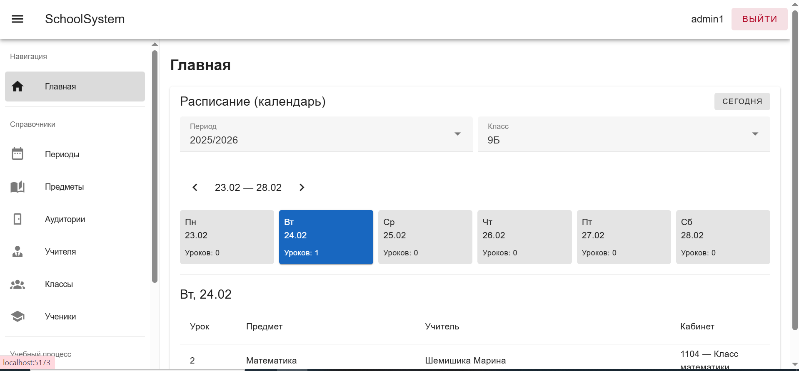
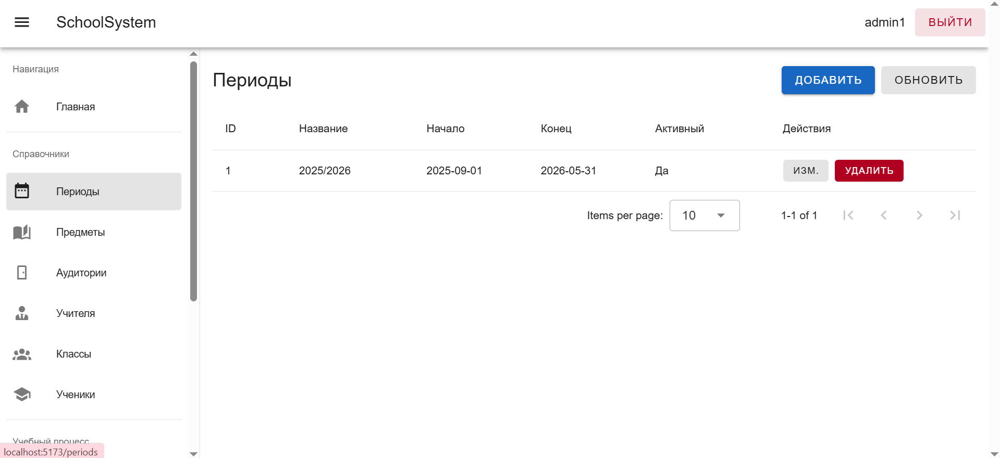
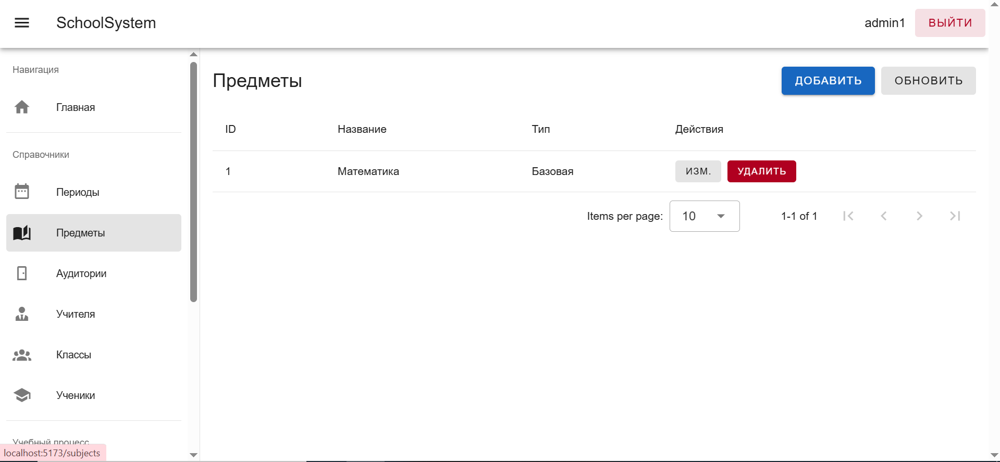
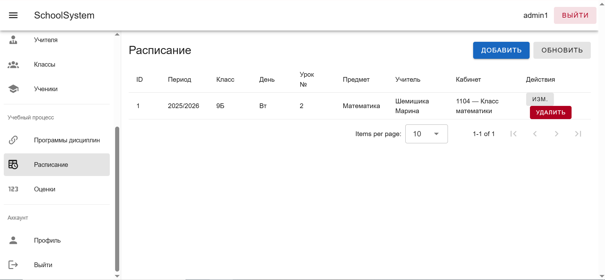
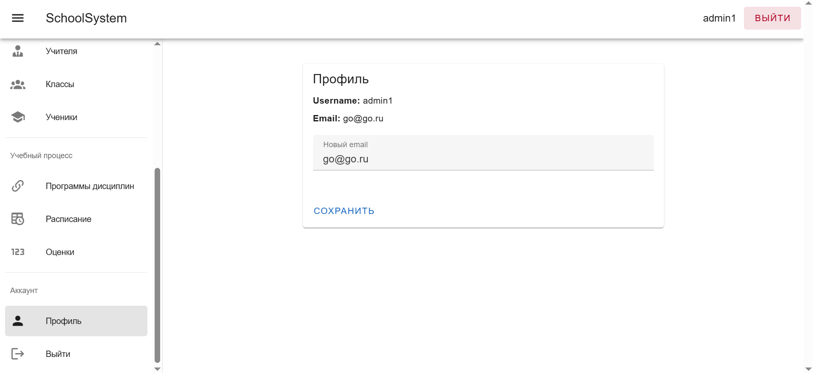

# Отчет по 4 лабораторной работе
Тема: Реализация интерфейса завуча для составления расписания и административных аспектов 
## Демонстрация главного меню для не авторизованного пользователя

## Интерфейс входа

## Интерфейс регистрации нового пользователя

## Интерфейс завуча (главная страница)

## Интерфейс назначения периодов образовательных программ

## Интерфейс назначения предметов

## Интерфейс со списком аудиторий

## Интерфейс со списком учителей

## Интерфейс классов и классных руководителей

## Интерфейс с учениками

## Интерфейс кем реализована дисциплина

## Интерфейс создания расписаний

## Интерфейс с оценками за четвертьи

## Страница профиля

